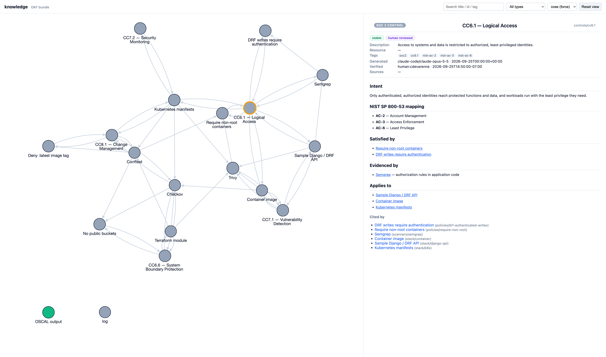
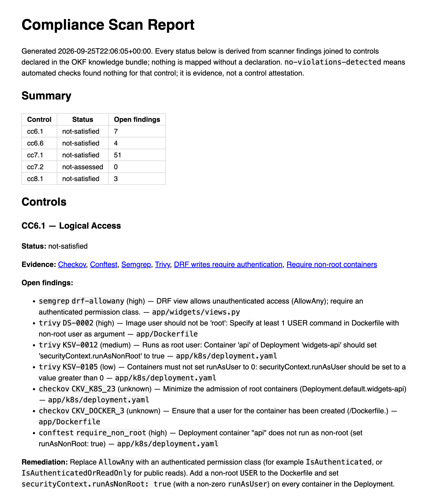

# okf-grc-skill

A portable [Open Knowledge Format](https://github.com/GoogleCloudPlatform/open-knowledge-format)
(OKF) knowledge bundle grounds an agent skill that scans a sample app, maps each
finding to a SOC 2 / NIST SP 800-53 control, emits OSCAL, and writes an
auditor-facing report.

*Organize knowledge → derive intelligence → take action.*

> **`app/` is intentionally vulnerable.** It exists only as a scan target, with
> seeded issues listed in [`app/SEEDED.yaml`](app/SEEDED.yaml). Do not deploy it.

## The one-command loop

```
make bootstrap         # uv sync + install pinned scanners into .tools/
make scan              # out/findings.json, out/mapping.json, out/oscal/*.json, out/report.md
make render            # out/knowledge-viz.html — the OKF graph
make test              # unit + Rego + Semgrep rule tests
make test-integration  # full scan; asserts every seeded issue lands where expected
make clean             # remove out/
```

Supported platforms: macOS arm64 and Linux x86_64 (the pinned scanner binaries).

## How grounding works

A finding reaches a control only through a `rule_ids` declaration in the bundle.
A finding with no declaration is reported as a **coverage gap**, never mapped by
guesswork. The scan surfaces dozens of such gaps; each one is a rule the bundle
has not yet claimed for any control.

## Screenshots





## Limits (v1)

- **Evidence, not attestation.** A control with no violations is reported as
  `no-violations-detected`, never `satisfied`. Automated scans evidence a SOC 2
  criterion; they do not attest it.
- **No suppression workflow.** Scanner-native inline skips (e.g. `checkov:skip`)
  are honored by the scanners themselves; there is no triage layer for false
  positives, so they appear as findings or coverage gaps.
- **Static manifests only.** Helm or Kustomize output is not rendered before
  scanning.
- **Sized for the sample app.** Scanner JSON is read in memory, and the
  scanner set is fixed in `run_scan.py`.
- **Fixed scan layout.** Conftest reads `k8s/**/*.{yaml,yml}` and
  `infra/**/*.tf` under the target; manifests or Terraform elsewhere are not policy-checked.

## Pins

All external versions are pinned in [`tools.lock`](tools.lock): Semgrep, Checkov,
Trivy, Conftest, the OKF spec (v0.2, by commit), and OSCAL 1.2.3. The OSCAL
output is a documented subset: see [`docs/oscal-subset.md`](docs/oscal-subset.md).

## Layout

| Path | What |
|---|---|
| `app/` | clean-room Django/DRF sample app, Dockerfile, Kubernetes, Terraform |
| `knowledge/` | the OKF bundle: controls, stack, guardrail policies, scanners |
| `policies/` | Rego guardrails (+ tests) and a vendored Semgrep rule |
| `.claude/skills/grc-continuous-compliance/` | the skill (`SKILL.md`) and its scripts |
| `docs/` | design spec, implementation plan, OSCAL subset |

## License

MIT
